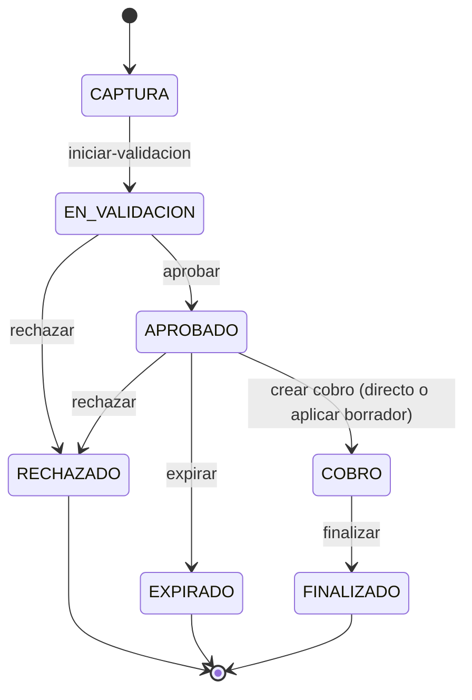
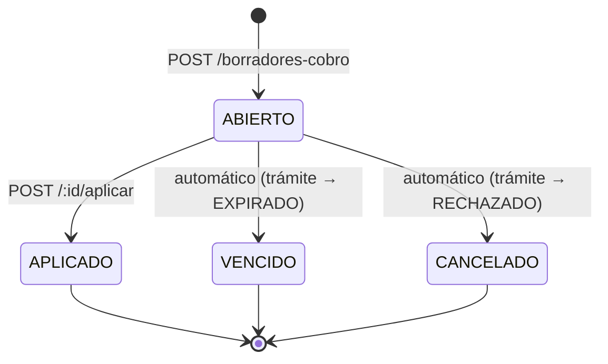

# Contrato de la API SICEF

## 1. Propósito y relación con el OpenAPI

`GET /api/v1/openapi.json` (generado por `backend/src/api/openapi.ts` a partir de los esquemas Zod de `@sicef/contracts`) es la **fuente de tipos**: rutas, parámetros, cuerpos de petición y formas exactas de respuesta, incluyendo detalles de serialización (fechas, decimales). Este documento es el complemento **narrativo**: lo que un JSON Schema no puede expresar — máquinas de estado, quién puede hacer qué transición y por qué, y las reglas de negocio que en realidad viven como triggers en `backend/prisma/migration_complementaria.sql`.

Úsalos juntos: para generar tipos de un cliente/frontend, parte del OpenAPI; para entender por qué una petición fue rechazada con `409` o qué se necesita antes de llamar a un endpoint, consulta este documento.

Base URL: `/api/v1`.

## 2. Autenticación y roles

Toda ruta interna exige `Authorization: Bearer <JWT>` emitido por Keycloak (realm `SOAPAP`, cliente `sicef`). Los roles se extraen literalmente del token y **cada rol solo es válido desde su fuente**; uno colocado en la fuente equivocada se ignora ([auth/claims.ts](backend/src/modules/auth/claims.ts)):

| Rol | Origen del claim | Habilita |
|---|---|---|
| `ventanilla` | `resource_access.sicef.roles` | Crear/transicionar trámites, evidencias, validaciones de no adeudo, borradores de cobro, cobro directo, emisión de constancias |
| `consulta-cobros` | `resource_access.sicef.roles` | Service account del sistema Finanzas: consulta de cobro y comprobante por folio |
| `consulta-metricas` | `resource_access.sicef.roles` | Service account del sistema Finanzas: indicadores de Dirección |
| `ti` | `realm_access.roles` | Asistente de catálogos/tarifas (crear, clonar, publicar), configurar plazos operativos, gestionar motivos de reducción, consultar bitácora de auditoría global |
| `direccion` | `realm_access.roles` | Consultar los indicadores de `GET /direccion/metricas` |

Las rutas bajo `/public/*` y `/health`, `/ready`, `/openapi.json` no requieren autenticación, pero `/public/*` tiene rate limiting (`PUBLIC_RATE_LIMIT_MAX` por `PUBLIC_RATE_LIMIT_WINDOW_MS`) y registra bitácora con `origen: PORTAL`.

## 3. Convenciones de alambre

- **Envolvente de éxito**: `{ "data": ..., "requestId"?: string }`. Los listados usan `{ "data": [...], "meta"?: { "nextCursor"?: string }, "requestId"?: string }`. `requestId` es opcional en el esquema porque algunas rutas no lo incluyen (`GET /catalogos/requisitos/activo`, las rutas `/public/*`).
- **Envolvente de error**: `{ "error": { "code": string, "message": string, "details"?: unknown }, "requestId"?: string }` (ver [shared/errors.ts](backend/src/shared/errors.ts)).
- **Fechas**: `string` ISO 8601 (`DateTime` de Prisma).
- **Montos**: `string`, no `number`. Prisma serializa `Decimal` (`montoBase`, `montoFinal`, `porcentajeReduccion`, `monto`, `adeudoMonto`) como string para no perder precisión — el cliente debe parsearlo explícitamente, nunca asumir `number`.
- **UUIDs**: `string` con formato `uuid`.
- **Archivos**: evidencias, PDFs de constancia y el comprobante de pago (voucher) del cobro se envían como `contenidoBase64`/`pdfBase64`/`comprobante.base64` dentro del JSON (no `multipart/form-data`). La cadena debe ser Base64 estricto en una sola línea (`^[A-Za-z0-9+/]+={0,2}$`): con saltos de línea o con prefijo `data:` la petición se rechaza con `422`. Límite de cuerpo HTTP: 42 MB; límite acumulado de evidencias por trámite: 30 MiB (31 457 280 bytes), impuesto por trigger — el comprobante no tiene un límite propio, solo el del cuerpo HTTP.
- **Paginación**: `GET /tramites` usa cursor (`take`, `cursor` como query params), no offset.

## 4. Máquinas de estado

Todas las transiciones las valida un trigger de PostgreSQL (`fn_tramite_transicion_valida`, `fn_borrador_cobro_integridad`, `fn_cobro_integridad` en `migration_complementaria.sql`) — el backend nunca decide por sí solo si una transición es válida; si la condición no se cumple, la transacción falla y la API responde `409`.

### 4.1 Trámite

Condiciones de guardia por flecha:

| Transición | Exige |
|---|---|
| `CAPTURA → EN_VALIDACION` | El checklist de requisitos aplicable (`fn_checklist_satisfecho`) está satisfecho: cada grupo aplicable tiene al menos una opción con todos sus documentos en evidencia `VALIDADO`. |
| `EN_VALIDACION → APROBADO` | Para `NO_ADEUDO`: existe `validacion_no_adeudo` con `momento=VALIDACION_INICIAL` y `resultado=SIN_ADEUDO`. Siempre: existe `configuracion_plazos` activa con `plazo_pago_dias > 0` (el trigger estampa `plazo_pago_hasta = now() + plazo_pago_dias`). |
| `APROBADO → COBRO` | `plazo_pago_hasta` no vencido. Para `NO_ADEUDO`: revalidación `REVALIDACION_COBRO` con `SIN_ADEUDO`. Existe un `cobro` cuya tarifa está `publicada`, `activa` y coincide en `tipo_constancia`. |
| `APROBADO → EXPIRADO` | Sólo después de `plazo_pago_hasta`. Efecto colateral: cualquier `borrador_cobro` `ABIERTO` pasa a `VENCIDO`. |
| `APROBADO → RECHAZADO` | Sin condición adicional. Efecto colateral: el `borrador_cobro` `ABIERTO`, si existe, pasa a `CANCELADO`. |
| `COBRO → FINALIZADO` | Existe `constancia` emitida. **Ya no exige CFDI timbrado**: la factura es una obligación independiente del sistema Finanzas, con su propio plazo fiscal, y puede solicitarse semanas después por el portal. |

`POST /tramites/{id}/{accion}` dispara estas transiciones vía el parámetro `accion` ∈ `{iniciar-validacion, aprobar, rechazar, expirar, finalizar}`. `APROBADO → COBRO` **no** se dispara por esta ruta: ocurre implícitamente al crear un cobro (`POST /tramites/{id}/cobros`) o al aplicar un borrador (`POST /tramites/{id}/borradores-cobro/{borradorId}/aplicar`).

### 4.2 Borrador de cobro

- Sólo puede existir **un** borrador `ABIERTO` por trámite (índice único parcial `uq_borrador_cobro_unico_abierto`); `POST` devuelve `409 DRAFT_ALREADY_OPEN` si ya hay uno.
- Un borrador `ABIERTO` sólo existe mientras el trámite está `APROBADO` y dentro del plazo de pago vigente. Cualquier `ventanilla` puede consultarlo (`GET`) o continuarlo (`PATCH`) — no está atado a quien lo creó.
- `VENCIDO`/`CANCELADO` son transiciones **automáticas** disparadas por el cambio de estado del trámite, nunca por una llamada directa a este endpoint.
- Al aplicar (`POST /:id/aplicar`), el trigger exige que el `cobro` recién creado coincida **exactamente** (tarifa, montos, forma/método de pago, moneda, referencia) con los datos del borrador — por eso el router construye ambos desde el mismo objeto de valores.

### 4.3 Máquinas que salieron de SICEF

`EstadoFactura` y `EstadoSolicitudFactura` se trasladaron al sistema Finanzas junto con el CFDI. SICEF conserva dos máquinas: trámite y borrador de cobro. Ver `documentacion2/SISTEMA_FINANZAS.md`.

## 5. Reglas de negocio por grupo de endpoints

### Catálogos y tarifas (`/catalogos/*`, rol `ti`)
- Versionados e **inmutables una vez publicados** (`publicada=true`): la estructura hija (grupos/opciones/documentos) no admite `INSERT`/`UPDATE`/`DELETE` sobre una versión publicada.
- Sólo puede haber una versión de catálogo y una tarifa (por `tipoConstancia`+`concepto`) `activa` a la vez — publicar una nueva desactiva la anterior en la misma transacción.
- El checklist es Y/O/Y: grupos aplicables se combinan con Y, las opciones de un grupo con O, los documentos de una opción con Y. La aplicabilidad de un grupo (`aplicaTipo`/`aplicaPersonalidad`/`aplicaRepresentacion`) es `NULL` = sin filtro (aplica a todos los valores de esa dimensión).
- `POST /catalogos/requisitos` y `POST /catalogos/tarifas` aceptan `clonarDesdeId` para partir de una versión/tarifa previa como base editable.
- `GET /catalogos/requisitos/{id}/validar` corre las mismas comprobaciones que `publicar` exige internamente (claves/orden sin duplicar, cobertura de combinaciones tipo×personalidad×representación) sin publicar nada — úsalo antes de intentar publicar.

### Trámites (`POST /tramites`)
- El domicilio del predio (`domicilioCalle`, `domicilioNumero`, `domicilioColonia`, `domicilioPerteneceA` ∈ `{JUNTA_AUXILIAR, MUNICIPIO}`, `domicilioPerteneceANombre`) es opcional a nivel de contrato — el backend lo acepta vacío igual que `nis`. Solo tiene sentido para `NO_REGISTRO`, porque va impreso en la constancia; la UI de ventanilla lo exige antes de crear el trámite de ese tipo, pero no hay validación equivalente en el servidor.
- Sin catálogo de juntas auxiliares/municipios: `domicilioPerteneceANombre` es texto libre. La zona de cobertura de SOAPAP abarca Puebla y 4 municipios más, por lo que una lista fija no era manejable; el domicilio se captura en mayúsculas desde el frontend para no fragmentar agrupaciones futuras por variaciones de mayúsculas/minúsculas.

### Evidencias
- MIME permitidos: `application/pdf`, `image/jpeg`, `image/png`. Hash SHA-256 de 64 hex.
- El documento debe pertenecer al **mismo catálogo estampado en el trámite** (`tramite.version_catalogo_id`), no al catálogo activo actual.
- El acumulado de evidencias del trámite no puede exceder 30 MiB.

### Motivos de reducción (`/motivos-reduccion`)
- `GET` está abierto a cualquier actor autenticado (ventanilla lo necesita para poblar el selector de reducción al cobrar); `POST`/`PATCH` exigen rol `ti`.
- Catálogo simple, sin versionado ni publicación como catálogos de requisitos o tarifas. El cliente nunca envía un porcentaje libre: solo elige un `motivoReduccionId` (o ninguno) y el backend deriva y **congela** el porcentaje en `cobro`/`borrador_cobro` al momento de aplicarse — editar o desactivar un motivo después nunca altera cobros ya registrados, solo deja de ofrecerse hacia adelante.

### Cobro (directo vs. borrador)
- **Directo**: `POST /tramites/{id}/cobros` crea el `Cobro` y transiciona `APROBADO → COBRO` en la misma llamada.
- **Con borrador**: `POST .../borradores-cobro` (crear) → `PATCH .../borradores-cobro/{id}` (completar datos, N veces) → `POST .../aplicar` (crea el cobro y transiciona). Útil cuando distintas ventanillas atienden al mismo trámite en momentos distintos.
- `monto_final` siempre es `round(monto_base * (1 - porcentaje_reduccion/100), 2)`, verificado por `CHECK`; el cliente no puede enviar un `montoFinal` arbitrario (no existe ese campo en el request).
- **Comprobante de pago (voucher), opcional**: tanto `CobroRequest` como `GuardarBorradorCobro` aceptan un campo anidado opcional `comprobante: { base64, nombreOriginal, mimeType }`, mismo tratamiento que un archivo de evidencia — se guarda en NFS (scope `comprobantes`) y se referencia con `archivoUuid`/`hashSha256`/`mimeType`/`nombreOriginal`/`tamanoBytes` en `cobro`/`borrador_cobro`. Al guardar un borrador con comprobante y luego aplicarlo, el comprobante **no se vuelve a subir**: `POST .../aplicar` (que no recibe body) copia la referencia ya guardada del borrador hacia el cobro final.

### Constancias
- **`POST /tramites/{id}/constancias` no lleva cuerpo**: el backend **genera** el PDF, no lo recibe. Antes aceptaba `pdfBase64` y `vigenciaFin`; ambos desaparecieron del contrato.
- Sólo se emite para un trámite en estado `COBRO`. El trámite debe tener una persona con rol `TITULAR`; sin ella responde `409 INVALID_STATE`.
- Requiere que exista **configuración** (`ConfiguracionConstancia`) para el tipo del trámite; si no, `409 CONSTANCIA_CONFIG_NOT_SET`. No hay valor por defecto a propósito: la vigencia y el firmante de un documento oficial no deben caer a un número que nadie decidió.
- Requiere que exista una **plantilla** registrada para ese tipo; si no, `409 TEMPLATE_NOT_CONFIGURED`. Los dos tipos existentes ya la tienen, transcrita del documento que SOAPAP emite hoy (`documentacion/constancia_no-registro.txt` y `constancia_no-adeudo.txt`); el registro sigue siendo parcial para que un tipo nuevo sin texto aprobado se rechace en vez de producir un documento con contenido inventado.
- Para `NO_ADEUDO`, el trámite debe traer **NIS**: el cuerpo del documento nombra el número de suministro. Sin él, `409 INVALID_STATE` — antes que imprimir un hueco en un documento oficial, no se emite.
- `vigenciaFin` se calcula en el servidor como `emitidaAt + vigenciaDias` (días naturales) tomando `vigenciaDias` de la configuración. El mismo número se interpola en el cuerpo impreso, de modo que el documento nunca puede contradecir su propia vigencia registrada.
- El QR de verificación va **estampado en el PDF**. Por eso el folio, el `versionToken` y la `urlVerificacion` se resuelven *antes* de renderizar: el orden es `folio → token/URL → renderizar → guardar → hashear → firmar → INSERT`. Nada puede modificarse después de firmar sin invalidar la firma.
- **La emisión no firma digitalmente.** El Servicio de Firma quedó fuera del proyecto (tentativamente), así que `firmaDigital` y `certificadoId` nacen en `null` — el modelo ya los declaraba opcionales. El backend sí calcula y persiste el hash SHA-256 del PDF (`hashPdf`) como ancla de integridad del archivo. La autenticidad del documento se sostiene en la **firma autógrafa** del papel y en la **verificación pública por QR**.
  - Consecuencia a tener presente: `trg_constancia_inmutable` cubre `firma_digital`, de modo que una constancia emitida sin firma **no puede firmarse después** con un `UPDATE`. Si el Servicio de Firma se reincorpora, las constancias históricas quedarán sin firma.
  - El cliente HTTP del servicio sigue en `backend/src/infrastructure/signing/`, sin uso, para cuando vuelva.
- `folioUnico` tiene el formato `SICEF-{numeroTramite}-{8 hex}`.
- El PDF imprime, bajo la fecha, el **número de oficio** (`{oficioPrefijo}/{año de emitidaAt}`, tomado de `ConfiguracionConstancia`) además del folio — ver la sección de configuración de constancias más abajo. El oficio no es único por documento; el folio sí.
- **Dos hashes distintos, con propósitos distintos**: `hashPdf` es SHA-256 sobre los bytes del archivo (integridad del archivo); `hashContenido` es SHA-256 sobre los datos estructurados (`folioUnico`, `tipoConstancia`, id del titular, `emitidaAt`, `vigenciaInicio`, `vigenciaFin`) y es el ancla de integridad del **registro**, independiente de cómo se renderice el PDF.
- Por eso `emitidaAt` lo fija el backend antes del `INSERT` en vez de dejarlo al `now()` de PostgreSQL: el hash se calcula sobre el valor exacto que se persiste, y corregirlo después con un `UPDATE` chocaría con `trg_constancia_inmutable`.
- La respuesta incluye `urlVerificacion`, campo **derivado** (no es columna): la URL que codifica el QR impreso. `GET /tramites/{id}` también la reconstruye dentro de `constancia`. Es `null` si la versión de clave con la que nació la constancia ya fue retirada.
- **`GET /tramites/{id}/constancias/{constanciaId}/archivo`** descarga el PDF emitido (rol `ventanilla`). Es la **única excepción a la envolvente `{ data }`**: devuelve el binario con `Content-Type: application/pdf` y `Content-Disposition: attachment; filename="constancia-{folioUnico}.pdf"`. Los errores sí conservan el formato `{ error: { code, message } }`.
  - El archivo se resuelve por `archivo_generado` (`tipo=PDF`, `conservacion=ACTIVO`) **acotado al `tramiteId` de la ruta**: pedir el `constanciaId` de otro trámite responde `404`, no el documento ajeno.
  - La ruta en disco sale siempre de `archivo_generado.ruta`, nunca de un parámetro, y el adaptador de NFS revalida que quede dentro del directorio del scope.
  - El `Content-Type` se fija explícitamente porque en NFS los archivos se guardan con el UUID como nombre, **sin extensión**: no puede inferirse.
  - Los bytes servidos son los mismos que se firmaron; su SHA-256 debe coincidir con `constancia.hashPdf`.

### Integración con el sistema Finanzas (sólo lectura)
- `GET /constancias/{folio}/cobro` y `GET /constancias/{folio}/cobro/comprobante` (rol `consulta-cobros`): datos del cobro y el ticket adjunto, llaveados por el folio de la constancia. El JSON no lleva datos personales; el comprobante va en ruta aparte y muestra lo que muestre el ticket.
- `GET /direccion/metricas?desde=&hasta=` (roles `direccion` o `consulta-metricas`): seis KPIs, serie mensual de constancias por tipo y distribución por estado. El éxito de timbrado y las cancelaciones de CFDI no están aquí: son de Finanzas.
- La solicitud y la consulta de CFDI se trasladaron a ese sistema. Ver `documentacion2/SISTEMA_FINANZAS.md`.

### Verificación pública de constancias por QR (`GET /public/constancias/{folio}/verificar/{token}`)

Es un servicio de consulta de SOAPAP sobre su propio registro: confirma que el folio existe, que lo emitió SOAPAP, a nombre de quién y en qué estado de vigencia está. **No sustituye la firma autógrafa del documento ni pretende valor probatorio autónomo.**

- **El token funciona como capacidad, no como firma**: es HMAC-SHA256 del folio truncado a 80 bits, con la versión de clave al frente (`v1.a1b2c3d4e5f60718a9bc`). Sólo quien tiene el documento impreso —donde va el QR— puede consultarlo. **No existe una ruta equivalente sin token**, y es deliberado: `folioUnico` lleva el consecutivo del trámite, así que una ruta por folio solo sería enumerable.
- **Folio inexistente y token inválido devuelven un `404` idéntico**, mismo cuerpo y mismo código. Si difirieran, el endpoint confirmaría qué folios existen y volvería a ser enumerable. Por la misma razón la consulta a la base de datos se ejecuta incluso con token inválido: el tiempo de respuesta no debe delatar qué folios existen.
- **Una constancia vencida o anulada responde `200`**, no `404`: sí existe, y su estado real (`VIGENTE | VENCIDA | ANULADA`) es justo lo que quien escanea necesita saber. El estado se deriva de `anulada` y `vigenciaFin`; el enum de la respuesta **no** incluye `NO_ENCONTRADA` — ese caso es el `404`.
- **Rate limit propio**, más estricto que el global de `/public` (`VERIFICACION_RATE_LIMIT_MAX` por `VERIFICACION_RATE_LIMIT_WINDOW_MS`, por omisión 10/min): con un HMAC truncado y una respuesta que expone titular y domicilio, este limitador es lo que separa una fuerza bruta de una fuga de datos personales.
- **Sólo sale el mínimo**: folio, tipo, estado, vigencia, nombre del titular y —únicamente en `NO_REGISTRO`— el domicilio del predio. Nunca RFC, identificadores internos, NIS, hashes, ni personas distintas del titular (representante, apoderado o receptor fiscal). La restricción se aplica desde el `select` de Prisma, no sólo en el DTO — mismo criterio que la bitácora.
- **Claves versionadas y rotables**: `SECRETO_VERIFICADOR_V1`/`_V2` (mínimo 32 bytes cada una) y `VERSION_TOKEN_ACTUAL`. Cada constancia persiste en `versionToken` la versión con la que nació, así que rotar la clave no invalida lo ya impreso; una versión sólo se retira cuando ninguna constancia vigente la referencia. Para rotar: definir `SECRETO_VERIFICADOR_V2` y apuntar `VERSION_TOKEN_ACTUAL` a `v2`.
- Cada intento —válido o no— queda en bitácora con `origen: PORTAL`, `accion: VERIFICAR_QR` y `detalle.resultado` ∈ `{VALIDO, FOLIO_INEXISTENTE, TOKEN_INVALIDO}`. Los intentos sin folio real se asientan contra el UUID centinela `…0002`, porque `bitacora.entidad_id` es `NOT NULL`.

### Bitácora (`/bitacora`, rol `ti`)
- Visor de auditoría global de solo lectura sobre `bitacora`, filtrable por `entidad`, `entidadId`, `accion`, `actorId` y rango de fechas (`desde`/`hasta`), paginado por cursor.
- `ip_address`/`user_agent` **nunca se exponen** en la respuesta — se excluyen desde el `select` de Prisma, no solo del DTO.
- Distinto de un futuro `GET /tramites/{id}/bitacora` para `ventanilla` (aún no implementado, ver `PENDIENTES_BACKEND_FRONTEND.md`): ese caso necesitaría acotarse siempre al trámite abierto; este es de auditoría global, exclusivo de `ti`.

### Configuración de constancias (`/administracion/constancias/{tipo}`, rol `ti`)
- `GET` devuelve `null` si ese tipo nunca se configuró — la UI distingue "sin configurar" de un valor real, y la emisión de ese tipo falla hasta que exista.
- `PUT` hace *upsert* de `vigenciaDias`, `firmanteNombre`, `firmanteCargo` y `oficioPrefijo`. `{tipo}` ∈ `{NO_ADEUDO, NO_REGISTRO}`; cualquier otro valor responde `404`.
- `oficioPrefijo` es el prefijo del número de oficio impreso bajo la fecha; se compone con el año de emisión como `{oficioPrefijo}/{año}` (p. ej. `SOAPAP/GSTS/CNR/2026`), **sin consecutivo** — todas las constancias del mismo tipo y año comparten el mismo número de oficio. El folio sigue siendo el identificador único del documento y se imprime junto a él.
- Hay **una fila por tipo de constancia** (no un singleton como `ConfiguracionPlazos`), porque el plazo legal puede diferir entre tipos. El firmante, en cambio, se modela como valor institucional por tipo.
- La tabla **nace vacía**: no hay semilla. Hasta que `ti` configure al menos `NO_REGISTRO`, no se puede emitir ninguna constancia de ese tipo.
- Cambiar la configuración **no altera constancias ya emitidas**: `vigenciaFin` y los datos del firmante quedaron congelados en el PDF y en el registro al momento de emitir.
- Se audita con UUID "bien conocido" por tipo (`…0003` para `NO_ADEUDO`, `…0004` para `NO_REGISTRO`), porque la PK es el enum y `bitacora.entidad_id` es UUID estricto — mismo recurso que `…0001` (plazos) y `…0002` (centinela de verificación).

## 6. Flujo típico end-to-end

1. `ti` configura plazos y constancias: `PUT /administracion/plazos` y `PUT /administracion/constancias/{tipo}` (vigencia y firmante; sin esto no se puede emitir).
2. `ti` publica catálogo y tarifa: `POST /catalogos/requisitos` (+ `grupos`/`opciones`/`documentos`) → `.../publicar`; `POST /catalogos/tarifas` → `.../publicar`.
3. `ventanilla` crea el trámite: `POST /tramites` (usa la versión de catálogo activa automáticamente; si es `NO_REGISTRO`, captura también el domicilio del predio).
4. `ventanilla` sube evidencias: `POST /tramites/{id}/evidencias` (una por documento requerido).
5. `ventanilla` transiciona: `POST /tramites/{id}/iniciar-validacion` (el checklist debe estar satisfecho).
6. `ventanilla` registra validación inicial (si `NO_ADEUDO`): `POST /tramites/{id}/validaciones/no-adeudo` con `momento=VALIDACION_INICIAL`.
7. `ventanilla` aprueba o rechaza: `POST /tramites/{id}/aprobar` (estampa `plazoPagoHasta`) o `.../rechazar`.
8. En `APROBADO`: opcionalmente `POST .../borradores-cobro` para guardar avance; si `NO_ADEUDO`, registrar revalidación con `momento=REVALIDACION_COBRO`.
9. Cobrar: `POST /tramites/{id}/cobros` (directo) o `POST .../borradores-cobro/{id}/aplicar` → trámite pasa a `COBRO`; opcionalmente se adjunta el comprobante de pago (voucher) al cobro directo o al borrador antes de aplicarlo.
10. Emitir constancia: `POST /tramites/{id}/constancias`, sin cuerpo. El backend genera el PDF con el QR ya estampado, lo firma y lo guarda. La respuesta trae `urlVerificacion` (la misma que codifica el QR impreso); el ciudadano la consulta después con `GET /public/constancias/{folio}/verificar/{token}`.
11. Si el ciudadano quiere factura, la solicita en el portal del sistema Finanzas con el folio de su constancia. SICEF no participa: `cobro.facturaSolicitadaEnVentanilla` sólo registra qué contestó ese día.
12. El timbrado real (UUID/XML/PDF, paso a `TIMBRADO`) y `POST /tramites/{id}/finalizar` ocurren cuando esos requisitos ya se cumplieron — el timbrado en sí lo hace el worker futuro, fuera de esta API.
13. Si el plazo de pago vence sin cobrar: `POST /tramites/{id}/expirar`.

## 7. Catálogo de códigos de error

Todos siguen el formato `{ "error": { "code", "message", "details"? } }` ([shared/errors.ts](backend/src/shared/errors.ts)).

| `code` | HTTP | Cuándo ocurre |
|---|---|---|
| `UNAUTHENTICATED` | 401 | Falta el header `Authorization` o no hay `actorId`/`auth` resuelto |
| `INVALID_TOKEN` | 401 | El JWT no es válido (firma, issuer, audiencia, vigencia, o no es JWT) |
| `MISSING_ROLE` | 403 | El token no contiene ningún rol SICEF válido desde su fuente correcta |
| `FORBIDDEN` | 403 | El actor no tiene el rol requerido para la ruta |
| `NOT_FOUND` | 404 | Recurso inexistente (trámite, borrador que no pertenece al trámite, constancia o cobro por folio) |
| `VALIDATION_ERROR` | 422 | Falla de `zod.parse` sobre el body/query, o motivo de rechazo faltante |
| `NO_ACTIVE_CATALOG` | 409 | `POST /tramites` sin catálogo de requisitos activo y publicado |
| `CATALOG_ALREADY_PUBLISHED` | 409 | Intentar publicar un catálogo que ya estaba publicado |
| `CATALOG_INCOMPLETE` | 422 | El borrador de catálogo no pasa `erroresCatalogo` (grupos/opciones/documentos incompletos, orden o claves duplicadas, combinación sin ruta de cumplimiento) |
| `TARIFF_INCOMPLETE` | 422 | Falta `tipoConstancia`/`concepto`/`monto` al crear tarifa sin `clonarDesdeId` |
| `DRAFT_ALREADY_OPEN` | 409 | Ya existe un `borrador_cobro` `ABIERTO` para el trámite |
| `DRAFT_NOT_OPEN` | 409 | Se intenta aplicar un borrador que no está `ABIERTO` |
| `DRAFT_INCOMPLETE` | 422 | Faltan tarifa/forma de pago/método de pago/`facturaSolicitadaEnVentanilla` para aplicar el borrador |
| `INVALID_STATE` | 409 | Se intenta emitir constancia sin que el trámite esté en `COBRO`, sin titular, o sin NIS cuando el tipo es `NO_ADEUDO` |
| `CONSTANCIA_CONFIG_NOT_SET` | 409 | No hay `ConfiguracionConstancia` para el tipo del trámite: TI debe definir vigencia y firmante |
| `TEMPLATE_NOT_CONFIGURED` | 409 | No existe plantilla de constancia para ese tipo (hoy ninguno: los dos tipos están cubiertos) |
| `FILE_TOO_LARGE` | 422 | La evidencia excede `MAX_EVIDENCIA_TOTAL_BYTES` |
| `INVALID_PATH` | 400 | Un parámetro de ruta (`:id`, `:tramiteId`, etc.) llegó vacío o repetido |
| `INTERNAL_ERROR` | 500 | Cualquier error no anticipado (incluye fallas de trigger SQL que no se mapean explícitamente) |

Nota: muchas condiciones "de negocio" (transición inválida, tarifa no compatible, checklist incompleto) las detecta primero un **trigger de PostgreSQL**, no un `if` en el router. Cuando eso ocurre y el error no fue anticipado con un `AppError` específico, cae en `INTERNAL_ERROR` (500) con el mensaje crudo de Postgres en el log — no en la respuesta al cliente.
