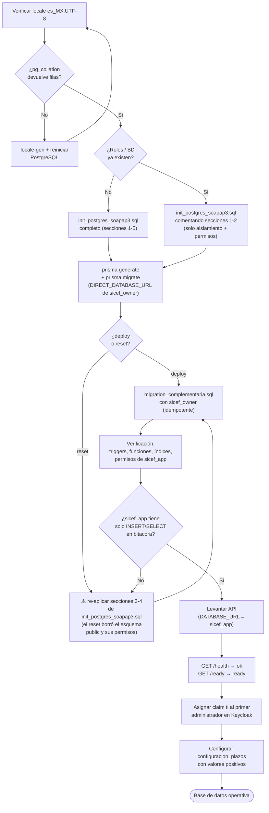

# Guía de despliegue de la base de datos SICEF

## 1. Propósito

Este documento describe, paso a paso, cómo dejar operativa la base `sicef_db` desde cero: desde `init_postgres_soapap3.sql` (roles, base, aislamiento y permisos) hasta `backend/prisma/migration_complementaria.sql` (reglas de integridad que Prisma no expresa). Complementa a `STACK_BACKEND_SICEF.md` y `GUIA_MODELO_SICNAF_Y_CATALOGOS.md`: aquellos explican el *qué* y el *por qué*; este explica el *cómo*, en orden, incluyendo los errores operativos ya detectados y su corrección.

Tres archivos intervienen, en este orden estricto:

```text
1. documentacion/init_postgres_soapap3.sql        → roles, base, aislamiento, permisos
2. backend/prisma/migrations/0001_init/migration.sql  → estructura (vía Prisma)
3. backend/prisma/migration_complementaria.sql    → CHECKs, triggers, índices, REVOKE final
```

Ningún paso es opcional ni intercambiable. `prisma migrate` por sí solo **no** instala las reglas del paso 3.

## 2. Diagrama de flujo



## 3. Prerrequisito obligatorio: locale `es_MX.UTF-8`

`init_postgres_soapap3.sql` crea `sicef_db` con `LC_COLLATE`/`LC_CTYPE` en `es_MX.UTF-8`. Ese locale debe existir en el sistema operativo **y** PostgreSQL debe haberse reiniciado después de generarlo (el motor carga los locales disponibles al arrancar):

```bash
locale-gen es_MX.UTF-8   # si aún no existe en el SO
sudo systemctl restart postgresql
sudo -u postgres psql -c "SELECT collname FROM pg_collation WHERE collname LIKE 'es_MX%';"
```

Si esa consulta no devuelve filas, **no continúes**: el `CREATE DATABASE` del paso 4 fallará.

## 4. Paso 1 — `init_postgres_soapap3.sql` (roles, base, permisos)

Ejecutar en el servidor de PostgreSQL (`172.16.1.45`), como `postgres`:

```bash
cd /ruta/donde/esta/el/archivo
chmod 600 init_postgres_soapap3.sql
# Reemplaza los <CAMBIAR_*> por contraseñas reales antes de ejecutar (openssl rand -base64 24)
sudo -u postgres psql -v ON_ERROR_STOP=1 -d postgres -f init_postgres_soapap3.sql
```

Qué instala (seguir el propio archivo como referencia autoritativa):

- **Sección 1 — Roles**: `sicef_owner` (dueño, DDL, solo para migraciones), `sicef_app` (runtime, solo DML), `sicef_ro` (solo lectura).
- **Sección 2 — Base**: `sicef_db`, encoding `UTF8`, locale `es_MX.UTF-8`, `OWNER sicef_owner`.
- **Sección 3 — Aislamiento**: revoca `CONNECT` de `PUBLIC` sobre `sicef_db`; solo los tres roles pueden conectarse.
- **Sección 4 — Permisos**: `GRANT` explícito sobre objetos existentes **y** `ALTER DEFAULT PRIVILEGES FOR ROLE sicef_owner` para que las tablas que Prisma cree *después* hereden automáticamente los permisos correctos de `sicef_app`/`sicef_ro`, sin GRANTs manuales tras cada migración. También crea la extensión `pgcrypto`.
- **Sección 5 — Verificación**: lista roles, bases y el ACL de conexión de `sicef_db` (no debe mostrar `=Tc/`, que sería acceso público).

**Si los roles y/o la base ya existen** (servidor no nuevo): comenta la sección 1 (y la 2 si `sicef_db` ya existe) antes de ejecutar — las secciones 3, 4 y 5 son idempotentes y se pueden re-aplicar sin problema.

**Después de ejecutarlo**: destruye el archivo con contraseñas en claro (`shred -u init_postgres_soapap3.sql`) o al menos muévelo fuera de cualquier repositorio.

## 5. Paso 2 — Migración estructural con Prisma

Desde `backend/`, usando la conexión **directa** de `sicef_owner` (nunca por PgBouncer/6432 — el pooler en modo transacción rompe los locks que usa `prisma migrate`):

```powershell
# Windows / PowerShell — cargar .env a variables de la sesión
Get-Content .env | ForEach-Object {
  if ($_ -match '^\s*([^#=][^=]*)=(.*)$') {
    [System.Environment]::SetEnvironmentVariable($matches[1].Trim(), $matches[2].Trim(), 'Process')
  }
}
npm run prisma:generate

$original = $env:DATABASE_URL
$env:DATABASE_URL = $env:DIRECT_DATABASE_URL
npx prisma migrate deploy --schema prisma/schema.prisma   # base ya limpia
# — o — npx prisma migrate reset --force --schema prisma/schema.prisma   (ver advertencia abajo)
$env:DATABASE_URL = $original
```

```bash
# Linux/macOS equivalente
set -a; source .env; set +a
npm run prisma:generate
DATABASE_URL="$DIRECT_DATABASE_URL" npx prisma migrate deploy --schema prisma/schema.prisma
```

Esto crea únicamente la estructura (tablas, enums, FKs, índices simples) definida en `backend/prisma/schema.prisma`. **Todavía no hay triggers, CHECKs de negocio ni índices únicos parciales** — eso lo instala el paso 6.

### ⚠️ Advertencia crítica sobre `prisma migrate reset`

`migrate reset` ejecuta `DROP SCHEMA public CASCADE; CREATE SCHEMA public;` antes de reaplicar las migraciones. El esquema `public` recreado es un **objeto nuevo**: los `GRANT`/`ALTER DEFAULT PRIVILEGES` que la sección 4 del paso 1 configuró sobre el `public` anterior **no se heredan**. El resultado es que `sicef_app` queda sin ningún privilegio sobre ninguna tabla — ni siquiera `SELECT` o `INSERT` — y la API falla toda escritura (empezando por `bitacora`, que se escribe en cada transacción de negocio).

**Si usaste `migrate reset`, antes de continuar al paso 6 debes re-ejecutar la sección 3 y 4 de `init_postgres_soapap3.sql`** (son idempotentes; no hace falta recrear roles ni base):

```bash
psql "postgresql://sicef_owner:<password>@172.16.1.45:5432/sicef_db" -v ON_ERROR_STOP=1 -c "
REVOKE CONNECT ON DATABASE sicef_db FROM PUBLIC;
GRANT  CONNECT ON DATABASE sicef_db TO sicef_owner, sicef_app, sicef_ro;
REVOKE ALL   ON SCHEMA public FROM PUBLIC;
GRANT  ALL   ON SCHEMA public TO sicef_owner;
GRANT  USAGE ON SCHEMA public TO sicef_app, sicef_ro;
GRANT SELECT, INSERT, UPDATE, DELETE ON ALL TABLES    IN SCHEMA public TO sicef_app;
GRANT USAGE, SELECT                  ON ALL SEQUENCES IN SCHEMA public TO sicef_app;
GRANT SELECT                         ON ALL TABLES    IN SCHEMA public TO sicef_ro;
ALTER DEFAULT PRIVILEGES FOR ROLE sicef_owner IN SCHEMA public
    GRANT SELECT, INSERT, UPDATE, DELETE ON TABLES TO sicef_app;
ALTER DEFAULT PRIVILEGES FOR ROLE sicef_owner IN SCHEMA public
    GRANT USAGE, SELECT ON SEQUENCES TO sicef_app;
ALTER DEFAULT PRIVILEGES FOR ROLE sicef_owner IN SCHEMA public
    GRANT SELECT ON TABLES TO sicef_ro;
CREATE EXTENSION IF NOT EXISTS pgcrypto;
"
```

En producción, usa siempre `prisma migrate deploy` (nunca `reset`) para no destruir el esquema entre despliegues.

## 6. Paso 3 — `migration_complementaria.sql` (reglas de integridad)

Se ejecuta **una sola vez por versión de base**, después de que la estructura ya existe, con la cuenta owner:

```bash
psql "postgresql://sicef_owner:<password>@172.16.1.45:5432/sicef_db" \
  -v ON_ERROR_STOP=1 --single-transaction \
  -f backend/prisma/migration_complementaria.sql
```

Qué instala (45 objetos + 4 índices + 1 bloque final):

- 9 `CHECK` (montos, vigencias, hash SHA-256, MIME, singleton de plazos, etc.).
- 4 índices únicos parciales: `uq_version_catalogo_unica_activa`, `uq_tarifa_unica_activa`, `uq_borrador_cobro_unico_abierto`, `uq_solicitud_factura_unica_pendiente`.
- 23 funciones `fn_*` y 22 triggers: contexto transaccional (`app.actor_id`/`app.roles`), inmutabilidad de catálogo/tarifa/constancia/archivo generado, máquina de estados de trámite/factura/borrador de cobro, checklist de requisitos, bitácora append-only y bloqueo de borrado histórico.
- Un bloque final `DO $$ ... $$` que revoca `UPDATE`/`DELETE` sobre `bitacora` específicamente para `sicef_app`, **si ese rol ya existe** — refuerzo a nivel de permisos de rol, además del trigger `fn_bitacora_protegida`.

El archivo usa `DROP TRIGGER IF EXISTS` / `DROP CONSTRAINT IF EXISTS` / `CREATE INDEX IF NOT EXISTS` / `CREATE OR REPLACE FUNCTION`, por lo que **es idempotente** — se puede re-ejecutar sin romper nada si hace falta (por ejemplo, después de corregir permisos, ver la advertencia del paso 5).

## 7. Verificación

```bash
# 1. Conteo de objetos (esperado: 22 triggers, 23 funciones)
psql "postgresql://sicef_owner:<password>@172.16.1.45:5432/sicef_db" -c "
  SELECT count(*) AS triggers  FROM pg_trigger WHERE NOT tgisinternal;
  SELECT count(*) AS funciones FROM pg_proc WHERE proname LIKE 'fn_%';
"

# 2. Índices únicos parciales (esperado: 4 filas)
psql "postgresql://sicef_owner:<password>@172.16.1.45:5432/sicef_db" -c "
  SELECT indexname FROM pg_indexes WHERE indexname LIKE 'uq_%';
"

# 3. Permisos de sicef_app sobre bitacora (esperado: solo INSERT, SELECT — nunca UPDATE/DELETE)
psql "postgresql://sicef_owner:<password>@172.16.1.45:5432/sicef_db" -c "
  SELECT grantee, privilege_type FROM information_schema.role_table_grants
  WHERE table_name = 'bitacora' AND grantee = 'sicef_app' ORDER BY privilege_type;
"

# 4. La API arriba y conecta con sicef_app (backend/, con DATABASE_URL = sicef_app)
npm run dev
# GET http://localhost:3000/api/v1/health  → {"data":{"status":"ok"}}   (no toca la BD)
# GET http://localhost:3000/api/v1/ready   → {"data":{"status":"ready"}} (SELECT 1 real vía sicef_app)
```

Si el punto 3 devuelve `0 rows` (ningún privilegio) o incluye `UPDATE`/`DELETE`, repite el bloque de permisos de la advertencia del paso 5 y vuelve a aplicar el paso 6.

## 8. Resumen operativo

```text
locale es_MX.UTF-8 verificado
  → init_postgres_soapap3.sql (roles + base + aislamiento + permisos + pgcrypto)
  → prisma migrate deploy (o reset) con DIRECT_DATABASE_URL de sicef_owner
      [si fue reset: re-aplicar secciones 3-4 de init_postgres_soapap3.sql]
  → migration_complementaria.sql con sicef_owner (idempotente)
  → verificar triggers/funciones/índices/permisos
  → API con DATABASE_URL de sicef_app: /health y /ready en verde
  → asignar claim de realm `ti` al primer administrador en Keycloak
  → configurar configuracion_plazos con valores positivos desde SICEF
```

## 9. Notas de seguridad

- Nunca pegues contraseñas reales en chats, tickets o logs compartidos — si ocurre, rota la credencial expuesta en cuanto termines las pruebas en curso.
- `sicef_owner` es exclusivamente para migraciones; `DATABASE_URL` de runtime siempre debe ser `sicef_app`, vía PgBouncer.
- Guarda las contraseñas generadas con `openssl rand -base64 24` en el gestor de contraseñas antes de ejecutar `init_postgres_soapap3.sql`, y destruye el archivo con `shred -u` después.
