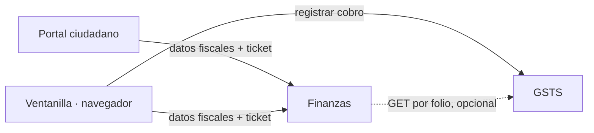
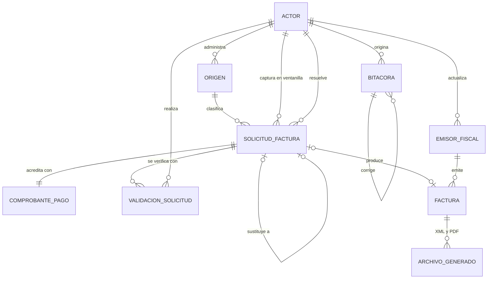
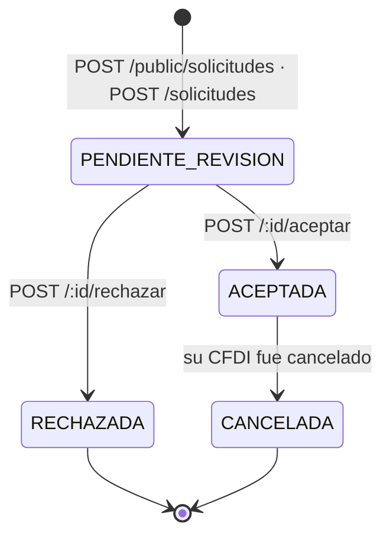
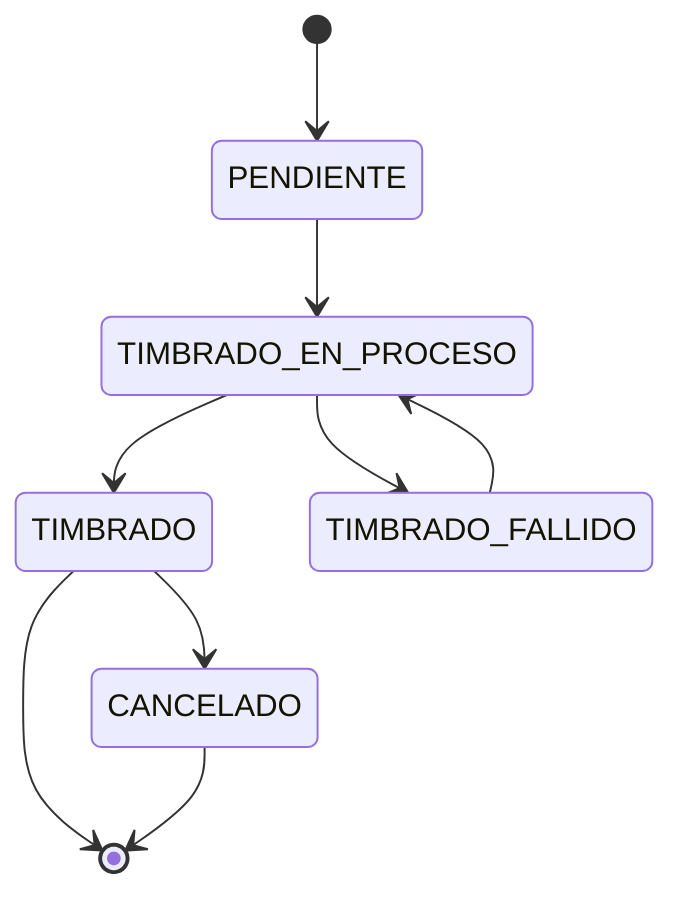

# Finanzas — sistema de facturación independiente

> Documento de estado destino de un sistema que **aún no existe**. Describe el
> monorepo nuevo que se hace cargo de la facturación de SOAPAP, hoy embebida en
> GSTS. Su contraparte es [SISTEMA_GSTS.md](SISTEMA_GSTS.md), que describe qué
> queda del lado de las constancias.

## 1. Propósito y por qué un monorepo aparte

SOAPAP factura más cosas que constancias: permisos de descarga, penalizaciones por actos de autoridad y conceptos que aún no están enumerados. Un CFDI no sabe ni le importa qué lo originó — es el mismo objeto fiscal con distinto concepto. Dentro de GSTS no cabe, porque allá la factura cuelga de un trámite de constancia.

### El hallazgo que hace viable la separación

Para permisos y penalizaciones **no existe un sistema de origen**. Nadie emite un adeudo que Finanzas pueda recibir. El ciudadano captura sus datos fiscales y su ticket de pago, y Finanzas valida contra los registros bancarios y contra el área correspondiente.

Eso cambia el diseño por completo. Finanzas no es un servicio que recibe cargos: su unidad de trabajo es una **solicitud autocontenida** que trae consigo todo lo necesario para emitir el CFDI, incluido el comprobante del pago. No hay nada que sincronizar.

La consecuencia práctica: la única superficie que Finanzas consume de GSTS es **una consulta de lectura, opcional**, que sirve para no capturar a mano lo que ya está capturado. Si GSTS no responde, Finanzas valida a mano — que es lo que hace para todos los demás orígenes de todos modos.



La flecha punteada es la única que cruza entre los dos sistemas, va en un solo sentido y su fallo no rompe nada. Sin transacción distribuida, sin outbox, sin cola, sin acoplamiento de disponibilidad. Es la clase de frontera que justifica separar.

### Por qué dos bitácoras está bien

La objeción seria a partir la base era la bitácora: en GSTS es append-only, única, y se escribe **en la misma transacción** que la mutación que audita. Partirla parecía debilitar una garantía deliberada.

No la debilita, porque esa garantía sólo importa cuando existe una transacción de negocio que cruza ambos sistemas — y aquí no existe ninguna. Cada bitácora audita sujetos distintos: trámites de un lado, solicitudes de factura del otro. Ninguna operación necesita aparecer atómicamente en las dos. Cada sistema conserva la garantía completa sobre lo suyo.

## 2. Alcance

**Fase 1:**

- Solicitud de factura multi-origen, recibida por portal público o capturada en ventanilla.
- Comprobante de pago adjunto, con hash SHA-256 sobre NFS.
- Validación manual atribuible contra banco y contra el área correspondiente.
- Verificación opcional contra GSTS cuando el origen es una constancia.
- Emisión de CFDI individual: se crea en `PENDIENTE` y el timbrado lo ejecuta el worker del PAC.
- Consulta pública del CFDI por referencia + RFC.
- Catálogo de orígenes administrable.
- Bitácora append-only.

**Fuera de alcance en fase 1:**

- Factura global / público en general (ver §12).
- El worker de timbrado ante el PAC — igual que en GSTS, aquí sólo se define el puerto.
- Firma digital (PKI).

**Crecimiento previsto.** El monorepo se llama Finanzas, no Facturación, a propósito: es el punto de partida para lo que el área necesite después —conciliación bancaria, control de ingresos, padrón de contribuyentes—. Nada del diseño de fase 1 lo estorba, porque `SolicitudFactura` no asume que la facturación sea lo único que vive aquí.

## 3. ERD

> **Vista completa con atributos:** [finanzas_erd.html](finanzas_erd.html) — las 9 entidades
> con sus columnas y llaves PK/FK/UK, con zoom, arrastre y modo claro/oscuro. Ábrelo en el
> navegador; funciona sin conexión. El diagrama de abajo es la versión resumida, sólo de
> relaciones.



Nueve entidades. Comparada con GSTS —veintiuna— es un sistema pequeño, y debe seguir siéndolo: la complejidad de GSTS vive en el catálogo de requisitos y su checklist, que aquí no tiene equivalente.

## 4. Modelo de datos

Mismas convenciones que GSTS: nombres físicos en `snake_case` singular, PK UUID, fechas `timestamptz(3)`, estados como enums de PostgreSQL, binarios en NFS con hash y sólo la referencia lógica en base.

### 4.1 `SolicitudFactura` — la raíz

Es autocontenida: trae origen, referencia, monto, fecha de pago, comprobante y datos fiscales. No tiene FK hacia ningún sistema externo.

| Campo | Tipo | Notas |
|---|---|---|
| `id` | uuid | |
| `numeroSolicitud` | int autoincrement | consecutivo legible para el ciudadano |
| `origenClave` | FK → `origen` | `CONSTANCIA`, `PERMISO_DESCARGA`, `PENALIZACION`, … |
| `referenciaOrigen` | text | folio de constancia, número de recibo, oficio. **Normalizada** (ver 4.2) |
| `origenCaptura` | `OrigenCaptura` | `PORTAL` \| `VENTANILLA` |
| `capturadoPorId` | FK → `actor`, nullable | null cuando `origenCaptura = PORTAL` |
| `concepto` | text | descripción que va al CFDI |
| `monto` | decimal(12,2) | lo que el ciudadano declara haber pagado |
| `moneda` | text, default `MXN` | |
| `fechaPago` | timestamptz(3) | la del ticket; ancla el plazo fiscal |
| `receptorRfc` | text | snapshot congelado, no se lee de ninguna tabla de personas |
| `receptorNombre` | text | |
| `receptorCp` | text | |
| `receptorRegimen` | text | código `c_RegimenFiscal` |
| `usoCfdi` | text | código `c_UsoCFDI` |
| `formaPago` | text | código `c_FormaPago` |
| `estado` | `EstadoSolicitud` | ver §5.1 |
| `fechaLimite` | timestamptz(3) | estampada por trigger: `fechaPago + origen.plazoSolicitudDias` |
| `facturaId` | FK → `factura`, unique, nullable | se llena al aceptar |
| `sustituyeASolicitudId` | FK → sí misma, nullable | reemisión tras cancelación del CFDI |
| `resueltaPorId` | FK → `actor`, nullable | |
| `resueltaAt` | timestamptz(3), nullable | |
| `motivoRechazo` | text, nullable | obligatorio si `RECHAZADA` |
| `solicitadaAt` | timestamptz(3) | |

### 4.2 Por qué los datos fiscales viven aquí y no en el cobro de GSTS

Se consideró guardarlos en `cobro` de GSTS —convirtiendo `requiereFactura` en un campo compuesto— y enviarlos desde allá. Se descartó por tres razones, la primera decisiva:

1. **Un RFC mal tecleado es el error más frecuente que va a haber.** El propio GSTS ya establece que los datos fiscales no se editan y que un error se corrige generando una solicitud nueva ([migration_complementaria.sql:389-394](../backend/prisma/migration_complementaria.sql)), y declara inmutables los campos canónicos del cobro ([526-535](../backend/prisma/migration_complementaria.sql)). Guardar datos corregibles dentro de un registro inmutable obliga a romper una de las dos reglas.
2. **La cardinalidad es 1:N sobre el tiempo**, no 1:1. Un pago puede generar varias solicitudes: rechazada → corregida → aceptada → cancelada → sustituta. Un campo compuesto en `cobro` le impone una forma que no tiene.
3. **GSTS quedaría como co-custodio** de RFC, régimen y CP sin necesitarlos para nada, en un sistema cuya disciplina de logging trata esos datos como veneno.

La ventanilla **sí** captura los datos fiscales. Lo que cambia es quién los envía: el navegador los manda directo a Finanzas, y el backend de GSTS nunca los ve.

**Normalización de `referenciaOrigen`.** Se guarda recortada y en mayúsculas. Sin esto, el índice anti-duplicado de §7 se burla con un espacio de más.

### 4.3 Las demás entidades

| Entidad | Papel |
|---|---|
| `Actor` | Proyección pseudónima del `sub` de Keycloak. Copiada tal cual de GSTS: sólo `keycloak_sub`, sin nombre, correo ni roles |
| `Origen` | Catálogo administrable: `clave`, `nombre`, `activo`, `plazoSolicitudDias`, `verificableEnSicef`. **Tabla, no enum** — va a crecer, y agregar un origen no debe ser una migración |
| `ComprobantePago` | El ticket: `archivoUuid`, `ruta`, `hashSha256`, `mimeType`, `tamanoBytes`. Mismo patrón que `Evidencia` en GSTS, incluida la restricción de MIME a PDF/JPEG/PNG |
| `ValidacionSolicitud` | Atribuible: `tipo` (`BANCARIA` \| `AREA` \| `GSTS`), `resultado` (`CONFIRMADO` \| `NO_CONFIRMADO`), `observacion`, `realizadaPorId`, `realizadaAt`, `datos` (jsonb, snapshot de lo consultado) |
| `Factura` | El CFDI. Migra desde GSTS casi intacta: cambia `cobroId` por su relación con la solicitud, y gana `emisorFiscalId` |
| `ArchivoGenerado` | XML y PDF del CFDI, con `EstadoConservacionArchivo`. Aquí sólo referencia facturas, así que no necesita el `num_nonnulls` de GSTS |
| `EmisorFiscal` | Singleton: RFC, razón social, régimen y lugar de expedición de SOAPAP. Nace vacío a propósito — sin emisor configurado no se factura |
| `Bitacora` | Idéntica a la de GSTS en estructura y en triggers, incluido el `REVOKE UPDATE, DELETE` al rol de aplicación |

## 5. Máquinas de estado

Como en GSTS, las transiciones las valida un trigger de PostgreSQL. El backend no decide por sí solo si una transición es válida.

### 5.1 Solicitud de factura



| Transición | Exige |
|---|---|
| `→ PENDIENTE_REVISION` | El origen existe y está `activo` con `plazoSolicitudDias > 0`. Existe comprobante de pago. `solicitadaAt <= fechaLimite`. No hay otra solicitud viva para la misma `(origen, referencia)` |
| `PENDIENTE_REVISION → ACEPTADA` | Rol `finanzas`. Existe al menos una `ValidacionSolicitud` con `resultado = CONFIRMADO`. Existe `EmisorFiscal` configurado. La `Factura` se crea en la misma transacción |
| `PENDIENTE_REVISION → RECHAZADA` | Rol `finanzas`. `motivoRechazo` obligatorio y `facturaId` nulo |
| `ACEPTADA → CANCELADA` | Su factura está en `CANCELADO`. Libera la referencia para una solicitud sustituta |

**No hay estados intermedios de validación.** Las verificaciones se registran como filas de `ValidacionSolicitud` sin mover el estado — exactamente como GSTS maneja `ValidacionNoAdeudo` y `ConfirmacionManual`. Es el mismo patrón, y evita una máquina de estados que se infle cada vez que aparezca un tipo de validación nuevo.

**Sobre `CANCELADA`.** Anticipa un caso fiscal cierto: cancelar un CFDI con UUID sustituto exige emitir uno nuevo por el mismo pago, y sin este estado el índice anti-duplicado de §7 lo bloquearía. Es la única parte del diseño que se adelanta a un requisito no solicitado explícitamente; se incluye porque el costo es un valor de enum y el costo de omitirlo es una migración bajo presión.

### 5.2 Factura (CFDI)



Se conserva sin cambios respecto a la actual de GSTS. Esta API **crea** la factura en `PENDIENTE` al aceptar la solicitud, pero no ejecuta las transiciones posteriores: obtener el CFDI del PAC, guardar UUID/XML/PDF y pasar a `TIMBRADO` es del worker de timbrado. `TIMBRADO` exige UUID + XML + PDF inmutables; `CANCELADO` exige motivo y UUID sustituto.

## 6. Los dos carriles de procedencia

Portal y ventanilla son dos clientes del **mismo** endpoint, con distinta autenticación. La diferencia no es cosmética: cambia cuánto trabajo manual necesita cada solicitud.

| | `PORTAL` | `VENTANILLA` |
|---|---|---|
| Actor | anónimo, sólo IP y user-agent | actor atribuible |
| El pago | un ticket que hay que creer | presenciado y registrado por quien captura |
| Referencia | se coteja contra registros bancarios | verificable con un `GET` a GSTS, si el origen es una constancia |
| Bitácora | `origen = PORTAL` | `origen = USUARIO` con `roles_snapshot` |
| Ruta típica | validación manual: banco + área | validación automática contra GSTS |

Una solicitud capturada en ventanilla cuya referencia GSTS confirma en monto y fecha tiene una calidad probatoria distinta a una anónima del portal. Finanzas puede resolverlas de forma acelerada y reservar la validación bancaria manual para las que de verdad la necesitan. **Ése es probablemente el mayor ahorro operativo de todo el rediseño**, y es la razón de que la captura en ventanilla valga la pena aunque el portal ya exista.

### El riesgo que introduce, y su red

Con los dos carriles abiertos se vuelve **probable** —no hipotético— que el ciudadano solicite en ventanilla, no vea confirmación clara, y vuelva a solicitar desde el portal en su casa. Dos solicitudes por el mismo pago, potencialmente dos CFDI.

Lo cubre el índice único de §7. Y el acuse hacia la persona es el ticket impreso: dice o *"factura solicitada, folio N"* o *"solicite su factura en el portal"*. Ése es el lugar correcto para cerrar el ciclo en una operación de ventanilla — no hace falta que dos bases de datos se pongan de acuerdo.

## 7. Reglas duras

Misma disciplina de dos territorios que GSTS: `schema.prisma` modela la estructura, `migration_complementaria.sql` instala las reglas, y `prisma migrate` por sí solo **no** las instala.

### 7.1 La regla central: una factura por pago

```sql
CREATE UNIQUE INDEX uq_solicitud_no_duplicada
  ON solicitud_factura (origen_clave, referencia_origen)
  WHERE estado NOT IN ('RECHAZADA', 'CANCELADA');
```

Sustituye al `UNIQUE(cobro_id)` sobre `factura` que la separación destruye. Es la única invariante que cruzaba conceptualmente los dos sistemas, y se resuelve **local a Finanzas** — GSTS no necesita saber nada.

Permite reintentar tras un rechazo (los datos corregidos entran como solicitud nueva) y permite la sustituta tras una cancelación, sin abrir la puerta a facturar dos veces el mismo pago.

Su violación no debe salir como un `409` seco. Código `SOLICITUD_DUPLICADA` con un mensaje que diga en qué estado está la solicitud existente y su número, para que el ciudadano entienda que ya la tiene en trámite.

### 7.2 El resto

| Regla | Qué hace |
|---|---|
| `fn_contexto_*` | Copiadas de GSTS sin cambios: exigen `app.actor_id` y `app.roles` en cada transacción de negocio |
| `fn_solicitud_integridad` | Transiciones de §5.1, estampado de `fechaLimite`, inmutabilidad de los datos fiscales una vez resuelta, exigencia de rol por transición |
| `fn_factura_integridad` | Transiciones de §5.2. `TIMBRADO` exige UUID + XML + PDF; `CANCELADO` exige motivo y UUID sustituto |
| `fn_comprobante_integridad` | `tamano_bytes > 0`, hash con formato SHA-256, MIME en PDF/JPEG/PNG |
| `fn_archivo_generado_inmutable` | Metadatos canónicos inmutables; no se borran, se marcan en `conservacion` |
| `fn_bitacora_protegida` | Append-only. `USUARIO` exige actor + roles + IP + user-agent + request_id; `PORTAL` exige IP + user-agent sin actor interno |
| `fn_origen_inmutable` | El `plazoSolicitudDias` de un origen puede cambiar hacia adelante, pero nunca recalcula `fechaLimite` ya estampadas |
| `fn_sin_borrado_historico` | Sobre `solicitud_factura`, `factura` y `comprobante_pago` |
| `CHECK` | `monto > 0`; `fecha_limite >= solicitada_at`; RFC, nombre, CP, régimen y uso CFDI no vacíos; `plazo_solicitud_dias > 0` cuando el origen está activo |
| `REVOKE` | `UPDATE, DELETE` sobre `bitacora` al rol de aplicación |

## 8. API

Mismas convenciones de alambre que GSTS: éxito `{ data, requestId? }`, listas `{ data, meta.nextCursor?, requestId? }` con paginación por cursor, error `{ error: { code, message, details? } }`. El documento OpenAPI se escribe a mano y se sirve en `GET /api/v1/openapi.json`, con la misma prueba de inventario literal que rompe al agregar o renombrar una ruta.

**Públicas** (sin auth, con rate limit y bitácora `origen = PORTAL`):

| Método | Ruta | Notas |
|---|---|---|
| `POST` | `/public/solicitudes` | Datos fiscales + comprobante en Base64. Límite de body amplio, como en GSTS |
| `GET` | `/public/facturas/{referencia}?rfc=` | Exige referencia **y** RFC. No expone detalle técnico del timbrado |
| `GET` | `/public/origenes` | Para poblar el selector del portal |

**Internas** (Keycloak + `bindActor` + rol):

| Método | Ruta | Rol |
|---|---|---|
| `GET` | `/auth/me` | cualquiera |
| `POST` | `/solicitudes` | `ventanilla` — captura asistida, marca `origenCaptura = VENTANILLA` |
| `GET` | `/solicitudes` | `finanzas` — bandeja con filtros por estado y origen |
| `GET` | `/solicitudes/{id}` | `finanzas` |
| `GET` | `/solicitudes/{id}/comprobante` | `finanzas` — descarga del ticket |
| `POST` | `/solicitudes/{id}/validaciones` | `finanzas` |
| `POST` | `/solicitudes/{id}/aceptar` | `finanzas` |
| `POST` | `/solicitudes/{id}/rechazar` | `finanzas` |
| `GET` | `/facturas`, `/facturas/{id}` | `finanzas` |
| `GET`/`POST`/`PATCH` | `/origenes` | `ti` |
| `GET`/`PUT` | `/administracion/emisor` | `ti` |
| `GET` | `/bitacora` | `ti` |

Códigos de error nuevos respecto al catálogo de GSTS: `SOLICITUD_DUPLICADA`, `ORIGEN_INACTIVO`, `PLAZO_VENCIDO`, `SOLICITUD_YA_RESUELTA`, `EMISOR_NO_CONFIGURADO`. Cada uno necesita su copy es-MX en el frontend, igual que hoy en `frontend/src/api/errors.ts`.

## 9. Integración con GSTS

Una sola llamada, servidor a servidor:

```
GET {GSTS}/api/v1/constancias/{folio}/cobro
GET {GSTS}/api/v1/constancias/{folio}/cobro/comprobante
```

**Cuándo se invoca:** al crear una solicitud cuyo origen tiene `verificableEnSicef = true` — hoy sólo `CONSTANCIA`. Para ese origen, `referenciaOrigen` **es el folio de la constancia**: único por construcción, impreso en el documento que el ciudadano se lleva, y por eso el índice anti-duplicado de §7 es sólido sin depender de quién teclea. La segunda ruta trae el ticket de la terminal, por si algún dato del comprobante importa para la validación.

**Qué se hace con el resultado:** se registra una fila `ValidacionSolicitud` de tipo `GSTS` con el snapshot en `datos`. Si el monto y la fecha coinciden con lo declarado, `resultado = CONFIRMADO` y la solicitud queda lista para aceptarse. Si no coinciden, `NO_CONFIRMADO` con la discrepancia en `observacion`, y pasa a revisión manual.

**Si GSTS no responde:** no se crea ninguna validación y la solicitud queda en `PENDIENTE_REVISION` esperando revisión manual. **No es un error**: es la ruta normal para todos los demás orígenes. La creación de la solicitud nunca falla por esto.

**Autenticación:** service account en el realm `SOAPAP` con un rol dedicado (`consulta-cobros`), distinto de los roles de personas. El token lo pide el backend de Finanzas por client credentials.

**La respuesta no trae PII** — sin RFC, nombres ni identificadores internos. Ver [SISTEMA_GSTS.md §8](SISTEMA_GSTS.md).

## 10. Estructura del monorepo y qué se copia

```
finanzas/
├─ backend/              Express 5 + Prisma 7 + PostgreSQL (base propia)
│  ├─ prisma/
│  │  ├─ migrations/                    estructura generada por Prisma
│  │  └─ migration_complementaria.sql   las reglas de §7
│  ├─ recursos/                         logotipos, fuera de src/
│  └─ src/
│     ├─ api/            router.ts, openapi.ts
│     ├─ config/         env.ts — falla al arrancar si falta cualquier variable
│     ├─ infrastructure/ database/, storage/, pac/ (sólo el puerto), gsts/ (cliente HTTP)
│     ├─ modules/        solicitudes/, facturas/, origenes/, administracion/,
│     │                  publico/, auth/, actores/, auditoria/, bitacora/, sistema/
│     └─ shared/         errors.ts, request-context.ts
├─ frontend/             Vite + React + MUI, mismo design system institucional
└─ packages/contracts/   @finanzas/contracts — esquemas Zod / DTOs
```

### Qué se copia de GSTS

Se copia el **patrón**, no un paquete compartido:

| Pieza | Origen |
|---|---|
| `createAuthenticate` + `requireRoles` | `backend/src/modules/auth/middleware.ts` |
| `bindActor` / `resolveActor` | `backend/src/modules/actores/middleware.ts` |
| `withBusinessTransaction` (`set_config` de `app.actor_id`, `app.roles`, `app.request_id`) | `backend/src/infrastructure/database/prisma.ts` |
| `requestContext` | `backend/src/shared/request-context.ts` |
| `AppError` + `errorHandler` | `backend/src/shared/errors.ts` |
| `auditarUsuario` | `backend/src/modules/auditoria/service.ts` |
| `NfsStorage` | `backend/src/infrastructure/storage/` |
| Redacción de Pino y la lista de campos prohibidos | `backend/src/app.ts` |
| Patrón `openapi.ts` + prueba de inventario literal | `backend/src/api/openapi.ts`, `backend/tests/contract/` |
| `theme.ts` (Institutional Flat System) y `MsIcon` | `frontend/src/app/` |

**Por qué copiar y no compartir.** Un paquete compartido entre dos repos exige publicar a un registro y coordinar versiones, y ata dos sistemas que deliberadamente se separaron. Son unas 500 líneas cruzando una frontera de contexto real, y el contrato entre ambos es **un solo endpoint**. La duplicación aquí es correcta, no deuda — cada sistema puede evolucionar su middleware sin pedir permiso.

**Rutas NFS separadas.** Finanzas escribe en sus propias raíces (`comprobantes/`, `facturas/`); ningún proceso escribe en las raíces del otro.

## 11. Keycloak

Mismo realm `SOAPAP`. Cliente nuevo `finanzas`, con roles `finanzas` (operador del área) y `ventanilla` (captura asistida). `ti` sigue viniendo de `realm_access.roles`.

Los roles se leen de los claims en el backend y de `GET /auth/me` en la UI — nunca de los claims del token en el frontend, misma regla que GSTS.

**El token de ventanilla.** El usuario de ventanilla ya tiene sesión SSO en el realm por GSTS. Para llamar a Finanzas, el frontend adquiere silenciosamente un segundo token con `audience = finanzas` (un `UserManager` adicional de `oidc-client-ts` contra el mismo authority). Requiere que el rol `ventanilla` exista también en el cliente `finanzas`. La alternativa —que Finanzas acepte tokens con `audience = gsts`— cruza la frontera de audiencia y no se recomienda.

**Service account** aparte para la consulta de §9, con el rol `consulta-cobros` en el cliente `gsts`.

## 12. Factura global: fuera de alcance

Se descartó **por el momento**: sólo se factura lo que alguien solicita expresamente. Eso elimina de este diseño `FacturaGlobal`, `FacturaGlobalDetalle`, la distinción "público en general" y las reglas de elegibilidad que hoy viven en GSTS ([migration_complementaria.sql:589-601](../backend/prisma/migration_complementaria.sql)).

Si vuelve, se reintroduce **completa dentro de Finanzas**, sin tocar GSTS:

- Tablas `factura_global` y `factura_global_detalle`, esta última apuntando a `solicitud_factura` en vez de a `cobro`.
- La máquina de estados de §5.2 se reutiliza tal cual — hoy en GSTS ya comparten `fn_factura_integridad`.
- Una regla que impida que una solicitud pertenezca a una global y a una individual a la vez, análoga a la actual.
- Falta una pieza que hoy no existe: la lista de pagos **no** solicitados que alimenta el periodo. Con el diseño actual Finanzas sólo conoce los pagos que alguien vino a facturar, así que esa lista tendría que venir de GSTS y de las demás áreas. **Ése es el trabajo real de reintroducirla**, no las tablas.

## 13. Decisiones abiertas

**Catálogos del SAT.** Hoy `c_UsoCFDI`, `c_RegimenFiscal` y `c_FormaPago` se guardan como códigos sueltos sin tabla que los valide. ¿Se modelan como catálogos propios —validación en base y selector poblado desde la API— o se siguen tratando como texto validado sólo por el PAC al timbrar? Modelarlos evita solicitudes que llegan hasta el timbrado para morir ahí.

**Dirección y los KPIs cruzados.** Los indicadores tocarían dos bases. Sin resolver; las opciones están en [SISTEMA_GSTS.md §10](SISTEMA_GSTS.md).

**Portal ciudadano.** Después de la separación apunta a dos backends: GSTS para verificar constancias, Finanzas para solicitar y consultar facturas. ¿Se acepta así o se pone un gateway al frente?

**Migración de datos existentes.** Si al momento del corte hay filas en `factura` y `solicitud_factura` de GSTS, hay que trasladarlas. Cada `solicitud_factura` actual se convierte en una solicitud de origen `CONSTANCIA` con `referenciaOrigen` = folio de la constancia, y `fechaPago` = `cobro.cobrado_at`. Falta decidir qué se hace con las que estén en `PENDIENTE_REVISION` al momento del corte.
