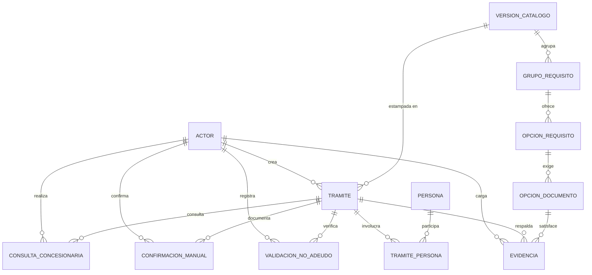
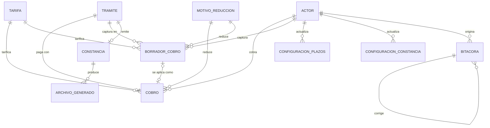
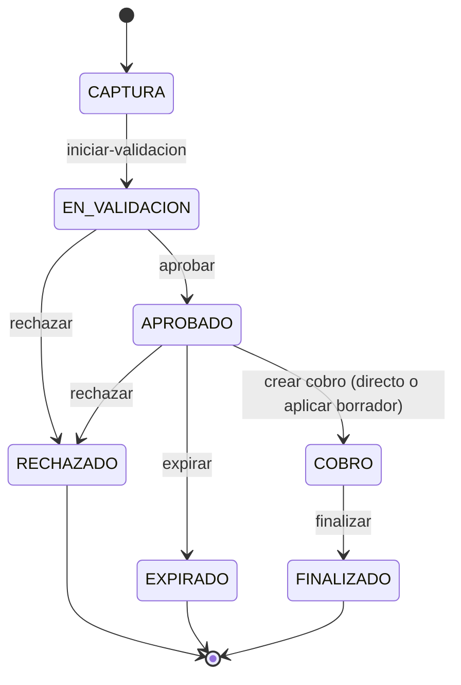
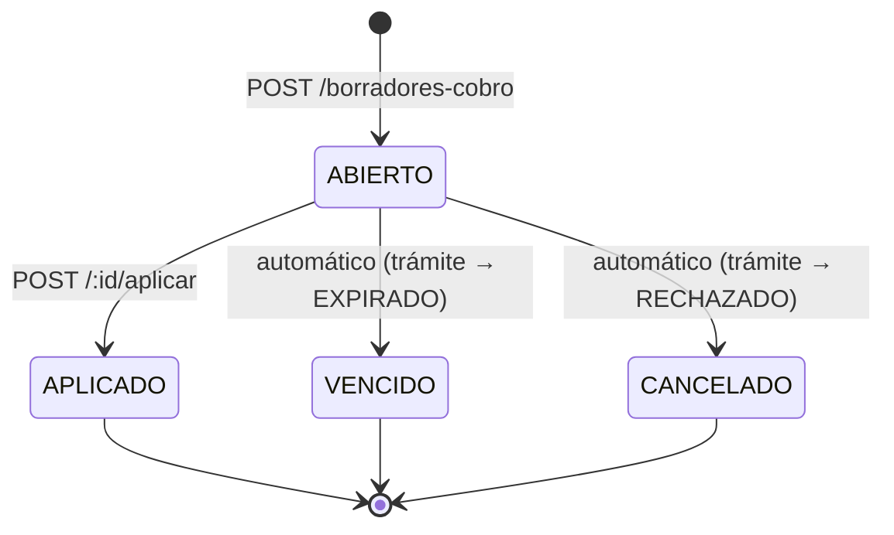
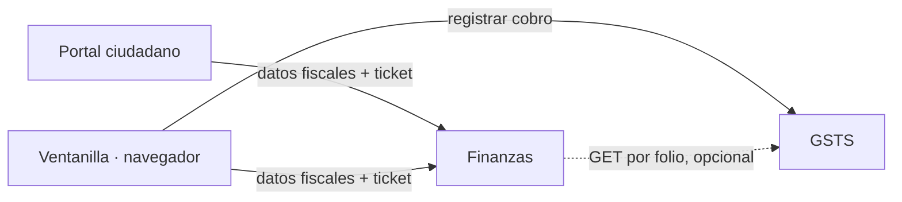

# GSTS después de la separación de facturación

> Documento de estado destino, ya alcanzado. Describe cómo queda GSTS una vez que la facturación
> se traslada a un sistema independiente. Su contraparte es
> [SISTEMA_FINANZAS.md](SISTEMA_FINANZAS.md), que sí sigue siendo un plan a futuro (ese sistema
> aún no existe).
>
> **El recorte de la sección 9 ya se ejecutó** — es de los primeros commits del repositorio
> (`aace26b Extraer la facturación de SICEF hacia el sistema Finanzas`, y la migración
> `0008_recorte_facturacion`). Los documentos de `documentacion/` ya describen este mismo estado
> posterior al recorte, no un estado anterior a él. La sección 9 se conserva como registro histórico
> de qué cambió y por qué, con cada paso anotado con su evidencia de cierre.

## 1. Propósito y qué cambia

SOAPAP necesita facturar más cosas que constancias: permisos de descarga, penalizaciones por actos de autoridad y otros conceptos. El modelo actual no lo permite, porque el CFDI cuelga de una cadena que termina en un trámite de constancia:

```
Tramite  1—1  Cobro  1—1  Factura
```

Una factura de un permiso de descarga no tiene trámite del que colgar. La salida no es generalizar `Tramite`, sino sacar la facturación a un sistema propio cuya unidad de trabajo no dependa de qué originó el pago.|

**GSTS deja de emitir CFDI.** Conserva todo lo demás, incluido el cobro.

### Por qué el cobro se queda

Podría parecer que el cobro debería irse con la facturación. No: en SOAPAP el cobro es lo que **habilita la entrega de la constancia**. El solicitante presenta su ticket en ventanilla y hasta entonces recibe el documento. Esa es una regla del trámite, no una regla fiscal. Si el cobro se fuera, GSTS no podría decidir por sí solo si entrega una constancia — que es justamente el acoplamiento que se busca evitar.

### Los tres cambios de comportamiento

| Cambio | Antes | Después |
|---|---|---|
| Cierre del trámite | `COBRO → FINALIZADO` exige CFDI timbrado si el cobro requería factura | Exige sólo constancia emitida. La factura es una obligación independiente con su propio plazo |
| Datos fiscales | Se capturan en ventanilla o portal y se guardan en GSTS (`solicitud_factura`) | GSTS nunca los custodia. Ventanilla los captura, pero el navegador los envía directo a Finanzas |
| Rol `finanzas` | Resuelve solicitudes dentro de GSTS | Desaparece de GSTS. Existe sólo en el sistema de Finanzas |

## 2. Alcance

**Conserva:**

- Trámite de constancia (`NO_ADEUDO`, `NO_REGISTRO`) con su máquina de estados.
- Catálogo de requisitos versionado e inmutable, y el checklist que gobierna el avance.
- Evidencias documentales sobre NFS con hash SHA-256.
- Validación de no adeudo (inicial y revalidación) y confirmaciones manuales atribuibles.
- Consultas a la concesionaria.
- **Cobro y borrador de cobro**, tarifas versionadas y motivos de reducción.
- Generación y emisión de la constancia en PDF con QR de verificación.
- Verificación pública de constancias por QR.
- Bitácora append-only.
- Administración de plazos y de configuración de constancias (rol `ti`).

**Deja de tener:**

- CFDI individual y global.
- Solicitudes de factura, tanto la ruta pública como su resolución interna.
- El rol `finanzas` y todo lo relativo a facturación (se extrajo por completo al sistema Finanzas; no quedó ningún módulo `facturacion/` en `backend/src/modules/`).
- La ruta pública de consulta de CFDI.

## 3. ERD

> **Vista completa con atributos:** [gsts_erd.html](gsts_erd.html) — las 21 entidades con
> sus columnas y llaves PK/FK/UK, con zoom, arrastre y modo claro/oscuro. Ábrelo en el
> navegador; funciona sin conexión. Los diagramas de abajo son la versión resumida, sólo
> de relaciones, para leer sin salir del editor.

Se presenta en dos vistas por legibilidad. Ambas describen la misma base.

### 3.1 Núcleo del trámite



### 3.2 Cobro, emisión y auditoría



`ARCHIVO_GENERADO` queda con **una sola** referencia posible (`constancia_id`); hoy admite tres. `BITACORA` no tiene FK hacia las entidades que audita: guarda `entidad` (texto) + `entidad_id` (UUID), y por eso sobrevive intacta al recorte.

## 4. Modelo de datos

De los 25 modelos actuales quedan **21**. El detalle campo por campo de lo que se conserva sigue siendo [GUIA_MODELO_SICNAF_Y_CATALOGOS.md](../documentacion/GUIA_MODELO_SICNAF_Y_CATALOGOS.md); aquí sólo se registra el delta.

### 4.1 Modelos eliminados

| Modelo | Destino |
|---|---|
| `Factura` | Migra a Finanzas, colgando de `solicitud_factura` en vez de `cobro` |
| `SolicitudFactura` | Migra a Finanzas y se convierte en la **raíz** del agregado |
| `FacturaGlobal` | Se descarta (ver [SISTEMA_FINANZAS.md](SISTEMA_FINANZAS.md) §12) |
| `FacturaGlobalDetalle` | Se descarta con la anterior |

### 4.2 Enums eliminados o recortados

| Enum | Cambio |
|---|---|
| `EstadoFactura` | Eliminado. Migra a Finanzas sin cambios |
| `EstadoSolicitudFactura` | Eliminado. Migra a Finanzas sin cambios |
| `RolPersona` | Pierde el valor `RECEPTOR_FISCAL`. El receptor fiscal es un dato de Finanzas y allá vive como snapshot congelado, no como persona registrada |

### 4.3 Modelos modificados

| Modelo | Cambio |
|---|---|
| `Cobro` | Pierde las relaciones `factura`, `solicitudesFactura` y `facturaGlobalDetalle`. `requiereFactura` se renombra (ver 4.4) |
| `ArchivoGenerado` | Pierde `facturaId` y `facturaGlobalId` con sus relaciones e índices. Queda con `constanciaId` obligatorio |
| `ConfiguracionPlazos` | Pierde `plazoSolicitudFacturaDias`. El plazo fiscal lo calcula Finanzas desde la fecha de pago |
| `Actor` | Pierde la relación `solicitudesFacturaResueltas` |
| `Persona` | Sin cambio estructural, pero deja de usarse para receptores fiscales |

### 4.4 `requiereFactura` → `facturaSolicitadaEnVentanilla`

Hoy `cobro.requiere_factura` es un campo **de estado**: tres reglas de base de datos dependen de él ([migration_complementaria.sql:536-544](../backend/prisma/migration_complementaria.sql)) y decide si el trámite puede finalizar.

Después del recorte no puede seguir siéndolo. La verdad sobre si existe una factura vive en Finanzas, y la solicitud puede llegar tres semanas más tarde por el portal — GSTS no tiene forma de saberlo ni de mantenerlo actualizado.

Se conserva como **dato informativo de la ventanilla**: qué contestó el solicitante ese día, para imprimirlo en el ticket y para indicadores. El renombre no es cosmético: evita que dentro de seis meses alguien lo lea como fuente de verdad. Las tres reglas de base de datos que lo custodiaban se eliminan.

> Alternativa válida: eliminarlo por completo. Se conserva porque el dato del ticket
> tiene valor operativo y su costo es una columna booleana.

## 5. Máquinas de estado

Todas las transiciones las sigue validando un trigger de PostgreSQL; el backend nunca decide por sí solo si una transición es válida.

### 5.1 Trámite



La topología no cambia. Cambia **una** guardia:

| Transición | Exige | Cambio |
|---|---|---|
| `CAPTURA → EN_VALIDACION` | Checklist aplicable satisfecho (`fn_checklist_satisfecho`) | — |
| `EN_VALIDACION → APROBADO` | Validación inicial del tipo: `SIN_ADEUDO` en `validacion_no_adeudo`, o `SIN_REGISTRO` en `validacion_no_registro`. Siempre: `configuracion_plazos` activa con `plazo_pago_dias > 0`; el trigger estampa `plazo_pago_hasta` | — |
| `APROBADO → COBRO` | `plazo_pago_hasta` vigente. Revalidación del tipo (`SIN_ADEUDO` / `SIN_REGISTRO`). Existe cobro con tarifa publicada, activa y del mismo `tipo_constancia` | — |
| `APROBADO → EXPIRADO` | Sólo después del vencimiento. Efecto: el borrador `ABIERTO` pasa a `VENCIDO` | — |
| `APROBADO → RECHAZADO` | Sin condición. Efecto: el borrador `ABIERTO` pasa a `CANCELADO` | — |
| `COBRO → FINALIZADO` | Existe constancia emitida | **Se elimina** la exigencia de CFDI timbrado |

Ese último renglón es el único punto donde GSTS leía datos de facturación. Al quitarlo, la dependencia queda en cero: **GSTS no consulta a Finanzas para nada.**

### 5.2 Borrador de cobro



Sin cambios. Un solo borrador `ABIERTO` por trámite; `VENCIDO`/`CANCELADO` son transiciones automáticas disparadas por el trámite, nunca por llamada directa.

### 5.3 Máquinas que desaparecen

`EstadoFactura` y `EstadoSolicitudFactura` se van completas a Finanzas. De las cuatro máquinas actuales, GSTS conserva dos.

## 6. Reglas duras: qué sale de `migration_complementaria.sql`

Se mantiene la disciplina de dos territorios: [schema.prisma](../backend/prisma/schema.prisma) modela estructura, [migration_complementaria.sql](../backend/prisma/migration_complementaria.sql) instala las reglas. El recorte toca sólo lo fiscal.

| Líneas actuales | Qué es | Acción |
|---|---|---|
| 11, 15-17, 23-24, 28 | `DROP TRIGGER` de tablas de factura | Eliminar los renglones |
| 59-64 | `chk_archivo_generado_ref` con `num_nonnulls(constancia_id, factura_id, factura_global_id) = 1` | Reescribir: `constancia_id IS NOT NULL` |
| 65-66 | `chk_factura_global_periodo` | Eliminar |
| 70-72 | `chk_configuracion_plazos_valores` | Quitar el término `plazo_solicitud_factura_dias > 0` |
| 81-88 | `chk_solicitud_factura_fecha_limite` y `chk_solicitud_factura_receptor` | Eliminar |
| 96-97 | `uq_solicitud_factura_unica_pendiente` | Eliminar |
| 349-415 | `fn_solicitud_factura_integridad` y su trigger | Eliminar completo |
| 506 | Guardia de CFDI timbrado en `fn_tramite_transicion_valida` | Eliminar el renglón y la variable `v_requiere_factura` |
| 536-544 | Las tres reglas de `requiere_factura` en `fn_cobro_integridad` | Eliminar |
| 550-601 | `fn_factura_integridad`, `fn_factura_global_detalle_integridad` y sus tres triggers | Eliminar completo |
| 607-608 | `fn_archivo_generado_inmutable` | Quitar `factura_id` y `factura_global_id` de las dos tuplas comparadas |
| 660-661 | `trg_factura_sin_borrado`, `trg_factura_global_sin_borrado` | Eliminar |

**Se conserva íntegro** todo lo demás, que es la mayor parte del archivo:

- Contexto transaccional: `fn_contexto_actor_id`, `fn_contexto_roles`, `fn_contexto_exige_actor`, `fn_contexto_exige_rol` (98-150).
- Inmutabilidad de catálogos y tarifas publicados (152-239).
- `fn_configuracion_plazos_integridad` (241-254).
- `fn_borrador_cobro_integridad` (256-347) — completa, incluida la coincidencia exacta entre borrador aplicado y cobro definitivo.
- `fn_evidencia_integridad` y el tope acumulado de 30 MB (417-435).
- `fn_checklist_satisfecho` (437-453).
- `fn_tramite_transicion_valida` (455-511), menos el renglón 506.
- `fn_cobro_integridad` (513-548), menos 536-544.
- `fn_constancia_inmutable` (616-629).
- `fn_bitacora_protegida` y el `REVOKE` sobre `sicef_app` (631-671).

El recorte no debilita ninguna garantía de GSTS: elimina reglas cuyas tablas ya no existen.

## 7. API resultante

Salen tres rutas y todo el módulo de facturación:

| Ruta | Acción |
|---|---|
| `POST /facturas/solicitudes/{id}/aceptar` | Migra a Finanzas |
| `POST /facturas/solicitudes/{id}/rechazar` | Migra a Finanzas |
| `POST /public/facturas/solicitudes` | Migra a Finanzas como `POST /public/solicitudes` |
| `GET /public/facturas/{folio}` | Migra a Finanzas, con `referencia` en vez de `folio` |

`GET /public/constancias/{folio}/verificar/{token}` **se queda**: la verificación por QR es del documento, no del pago. Se le sumó `POST /public/constancias/verificar` (folio + código, fallback manual sin QR) — mismo resultado, misma seguridad, ver `CONTRATO_API_GSTS.md`.

Inventario resultante, en el orden literal que debe reflejar `backend/tests/contract/openapi.test.ts`:

```
GET    /health, /ready, /openapi.json
GET    /public/constancias/{folio}/verificar/{token}    POST /public/constancias/verificar
GET    /auth/me
GET    /catalogos/requisitos/activo, /catalogos/requisitos
POST   /catalogos/requisitos
GET    /catalogos/requisitos/{id}/validar, /catalogos/requisitos/{id}/vista-previa
POST   /catalogos/requisitos/{id}/publicar, /catalogos/requisitos/{id}/grupos
POST   /catalogos/grupos/{id}/opciones, /catalogos/opciones/{id}/documentos
GET    /catalogos/tarifas/activas
POST   /catalogos/tarifas, /catalogos/tarifas/{id}/publicar
GET    /administracion/plazos                        PUT /administracion/plazos
GET    /administracion/constancias/{tipo}            PUT /administracion/constancias/{tipo}
GET    /personas                                     POST /personas
GET    /motivos-reduccion                            POST /motivos-reduccion
PATCH  /motivos-reduccion/{id}
GET    /bitacora
GET    /tramites, /tramites/{id}                     POST /tramites, /tramites/{id}/{accion}
POST   /tramites/{id}/evidencias                     PATCH /tramites/{id}/evidencias/{evidenciaId}
POST   /tramites/{id}/validaciones/no-adeudo
GET    /tramites/{id}/borradores-cobro               POST /tramites/{id}/borradores-cobro
PATCH  /tramites/{id}/borradores-cobro/{borradorId}
POST   /tramites/{id}/borradores-cobro/{borradorId}/aplicar
POST   /tramites/{id}/cobros, /tramites/{id}/constancias
GET    /tramites/{id}/constancias/{constanciaId}/archivo
GET    /constancias/{folio}/cobro                    ← nueva, ver §8
GET    /constancias/{folio}/cobro/comprobante        ← nueva, ver §8
GET    /direccion/metricas                           ← nueva, ver §8
```

Las convenciones de alambre no cambian: éxito `{ data, requestId? }`, listas `{ data, meta.nextCursor?, requestId? }`, error `{ error: { code, message, details? } }`.

## 8. Los puntos de integración

GSTS expone tres rutas de sólo lectura y no consume nada de Finanzas.

### 8.1 Cobro y comprobante, por folio de constancia

```
GET /api/v1/constancias/{folio}/cobro               → metadatos del cobro
GET /api/v1/constancias/{folio}/cobro/comprobante   → bytes del ticket
```

**Por qué el folio y no la referencia de pago.** El folio (`GSTS-{consecutivo}`, consecutivo real vía `contador_folio` — ver `CONTRATO_API_GSTS.md`) es `@unique`, va impreso en el documento que el ciudadano se lleva y ya lo usa el QR de verificación. `cobro.referencia_pago` es texto libre, **opcional y sin unicidad**: un cobro puede no tenerla y dos cobros pueden compartirla. Sirve como registro interno, nunca como llave de integración.

**Respuesta** de la primera, sin datos personales:

```json
{
  "data": {
    "folioConstancia": "GSTS-1234-A1B2C3D4",
    "tipoConstancia": "NO_REGISTRO",
    "emitidaAt": "2026-08-04T18:00:00.000Z",
    "concepto": "Constancia de no registro",
    "montoFinal": "350.00",
    "moneda": "MXN",
    "cobradoAt": "2026-08-04T17:20:00.000Z",
    "formaPago": "04",
    "metodoPago": "PUE",
    "referenciaPago": "…",
    "comprobante": { "nombreOriginal": "ticket.pdf", "mimeType": "application/pdf", "tamanoBytes": 84213, "hashSha256": "…" }
  },
  "requestId": "…"
}
```

Sin RFC, nombres, `nis` ni identificadores internos de trámite o persona. **El comprobante sí muestra lo que muestre el ticket** de la terminal: por eso va en su propia ruta, para que quede claro cuándo se pide el documento y no sólo sus metadatos. Es una entrega deliberada, para que Finanzas coteje contra los registros bancarios.

El folio sólo existe una vez emitida la constancia, así que ambas rutas responden `404` antes de eso — coherente con que solicitar factura implica que el pago ya ocurrió.

### 8.2 Indicadores de Dirección

```
GET /api/v1/direccion/metricas?desde=&hasta=
```

Seis KPIs, serie mensual de constancias por tipo y distribución de trámites por estado. El éxito de timbrado y las cancelaciones de CFDI no están aquí: son de Finanzas, que los agrega al componer el tablero. Sin parámetros, el periodo son los últimos 12 meses.

**Autenticación de las tres:** service account de Keycloak en el realm `SOAPAP`, con roles de cliente dedicados — `consulta-cobros` y `consulta-metricas`, no `ventanilla` ni `direccion`, que son roles de personas. Las llamadas son servidor a servidor: las hace el backend de Finanzas, nunca el navegador. `direccion` también se acepta en las métricas, por si algún día conviene consultarlas de forma directa.

### 8.3 GSTS no imprime acuses

La constancia es el único documento que ventanilla entrega y lo que finaliza el trámite. No hay acuse de cobro impreso: si el envío de datos fiscales a Finanzas falla, no existe papel donde avisarlo — hay que resolverlo en pantalla, del lado de Finanzas.

**Si esta ruta no responde**, Finanzas cae a validación manual contra los registros bancarios. Esa no es una ruta de contingencia inventada para el caso: es la ruta **normal** para permisos de descarga, penalizaciones y cualquier otro origen. La disponibilidad de GSTS nunca bloquea a Finanzas.

**Dirección de la dependencia:**



La flecha punteada es la única que existe, y va en un solo sentido. GSTS no conoce la existencia de Finanzas. No hay push, ni outbox, ni cola, ni transacción distribuida.

## 9. Plan de recorte — ✅ ejecutado

Orden pensado para que el árbol compile y las pruebas pasen al final de cada paso. Los 7 pasos ya se
aplicaron (migración `0008_recorte_facturacion`); se dejan aquí como registro de qué cambió y por qué,
cada uno con la evidencia que confirma su cierre.

**Paso 1 — Invertir la guardia de finalización. ✅**
Editar `fn_tramite_transicion_valida` (quitar el renglón 506 y la variable `v_requiere_factura`) y `fn_cobro_integridad` (quitar 536-544). Es el único cambio de comportamiento visible para el usuario y puede desplegarse solo, antes que todo lo demás.
*Cerrado:* `migration_complementaria.sql` ya no exige CFDI timbrado para cerrar un trámite — el comentario vigente dice *"El trámite cierra con la constancia emitida. La factura dejó de ser [relevante]"*.

**Paso 2 — Retirar rutas. ✅**
Borrar `backend/src/modules/facturacion/`, su import y su montaje en [router.ts](../backend/src/api/router.ts); las dos rutas de factura de [publico.router.ts](../backend/src/modules/constancias/publico/publico.router.ts); las entradas correspondientes de `backend/src/api/openapi.ts`; `solicitudFacturaPublicaSchema` y los DTO de factura de `packages/contracts/src/index.ts`.
*Cerrado:* `backend/src/modules/facturacion/` no existe en el árbol actual; no hay rutas de factura en `router.ts` ni en `openapi.ts`.

**Paso 3 — Recortar el esquema. ✅**
Quitar de [schema.prisma](../backend/prisma/schema.prisma) los cuatro modelos, los dos enums, el valor `RECEPTOR_FISCAL` y los campos de 4.3. Renombrar `requiereFactura`. Generar la migración.
*Cerrado:* `schema.prisma` no tiene el valor de enum `RECEPTOR_FISCAL`; el campo ya se llama `facturaSolicitadaEnVentanilla` (mapeado a la columna `factura_solicitada_en_ventanilla`).

**Paso 4 — Limpiar la SQL complementaria. ✅**
Aplicar la tabla de la sección 6. Recordar que el archivo se ejecuta **después** de `prisma migrate`, y que `prisma migrate` solo no instala nada de esto.
*Cerrado:* verificado contra `migration_complementaria.sql` vigente — sin triggers ni CHECKs de factura/CFDI/timbrado.

**Paso 5 — Agregar la consulta de integración. ✅**
Nueva ruta de la sección 8, con su rol de service account, su schema en `@gsts/contracts` y su registro en `openapi.ts`.
*Cerrado:* existen y están documentadas `GET /constancias/{folio}/cobro`, `GET /constancias/{folio}/cobro/comprobante` y `GET /direccion/metricas`.

**Paso 6 — Frontend. ✅**
Retirar el módulo Finanzas de [modulos.ts](../frontend/src/app/layout/modulos.ts), sus rutas, su `<RequireRole>` y sus mocks en `frontend/src/mocks/`. Regenerar tipos con `npm run gen:api`.
*Cerrado:* `modulos.ts` sólo lista Ventanilla, Administración y Bitácora, con un comentario explícito de que Finanzas y Dirección se trasladaron a la app de Finanzas.

**Paso 7 — Documentación. ✅**
Actualizar `documentacion/CONTRATO_API_GSTS.md` (§4.3, §4.4, la guardia de §4.1 y el catálogo de errores), `GUIA_MODELO_SICNAF_Y_CATALOGOS.md` y `PENDIENTES_BACKEND_FRONTEND.md`.
*Cerrado:* los tres documentos ya reflejan el estado posterior al recorte. `documentacion2/` no se fusionó con `documentacion/` todavía porque `SISTEMA_FINANZAS.md` sigue describiendo un sistema que aún no se construye — cuando exista, ambas carpetas pueden reconsiderarse.

## 10. Decisiones cerradas

**Dirección.** Su módulo vive en el frontend del sistema Finanzas y no toca la base de GSTS. El backend de Finanzas consulta `GET /direccion/metricas` con service account y reexpone el resultado ya compuesto con sus propios indicadores fiscales — así GSTS no necesita ser alcanzable desde el navegador.

**Frontend.** Dos aplicaciones separadas, una por sistema, cada una con su cliente Keycloak en el realm `SOAPAP`. La de GSTS conserva Ventanilla, Administración y Bitácora.

**Despliegue.** Finanzas corre en una VM/LXC aparte, con backend y frontend propios.

**Portal ciudadano.** Consume los endpoints de ambos backends —y de más, si en su momento se requieren—, sin gateway intermedio.
